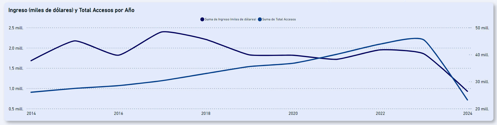

# Proyecto PIDA - Análisis del Acceso y Velocidad del Servicio de Internet en Argentina

## Introducción

Este proyecto tiene como objetivo analizar los datos de acceso y velocidad del servicio de Internet en Argentina, utilizando varias fuentes de datos. La presentación de los hallazgos se realizó con Power BI, destacando las tendencias y patrones identificados a lo largo del tiempo y entre las diferentes provincias del país.

## Fuentes de Datos

Los datos utilizados en este análisis provienen de diversas fuentes, como lo son ENACOM, Cámara Argentina de Internet y Banco Central de la República Argentina. Los datos se procesaron y limpiaron utilizando Python, y se exportaron a archivos CSV para su uso en Power BI.

## Estructura del Proyecto

```bash
Henry_PI2_Internet/
│
├── Datasets Power BI/
│   └── df_general.csv
│   └── df_no_provincia.csv
│   └── isp_por_provincia.csv
│   └── kpi_ingreso_promedio.csv
│   └── kpi_propuesto.csv
│   └── kpi_velocidad.csv
│
├── Datos/
│   └── Internet.xlsx
│   └── isp_por_provincias_2.pdf
│   └── tipos_cambio.csv
│
├── Notebooks
│   └── EDA.ipynb
│
└── README.md
```

- `Datasets Power BI/`: Todos los archivos csv utilizados para levantar el Dashboard.

- `Datos/`: Los archivos usados como fuentes.

- `EDA.ipynb`: Archivo en donde se encuentra todo el análisis realizado y el procesamiento de los datos.

- `README.md`: Archivo con la documentación del proyecto.

## Análisis y Hallazgos Clave

1. **Incremento en el Acceso al Servicio de Internet**:
    - Argentina posee 31.526 km de fibra óptica, lo que ha llevado a un incremento consistente en el número de accesos por cada 100 hogares, llegando a 77.66 para el año 2023.


2. **Contracción del Ingreso en Dólares**:
    - La crisis económica que ha vivido la nación en los últimos años no ha permitido convertir ese número creciente de accesos en valor monetario, observándose una contracción del ingreso en dólares desde el año 2017.



3. **Distribución de Proveedores de Servicios**:
    - El análisis de los datos muestra que el 80% de los proveedores de servicios se encuentran registrados en 7 provincias, lo que indica una competencia importante por la oferta de servicios en esas áreas.


4. **Comportamiento Estacionario de los Ingresos**:
    - Los ingresos en la industria del internet muestran un comportamiento estacionario, por lo que a nivel de marketing se recomienda tomar en cuenta este comportamiento para el manejo de promociones.

5. **Crecimiento Consistente de la Velocidad Media**:
    - A lo largo del tiempo de estudio, la velocidad media ha presentado un crecimiento consistente debido a la migración tecnológica a equipos de mayor velocidad. Sin embargo, este aumento no es homogéneo en todo el territorio, siendo notable la diferencia en Buenos Aires en comparación con otras provincias.


## Funcionalidad de los KPI

1. **KPI incremento trimestral 2% de Accesos**:
    - Este KPI evalúa si se cumple con el incremento del 2% en Accesos por cada 100 hogares de un trimestre a otro.

2. **KPI incremento trimestral del 3% de velocidad media**:
    - Este KPI evalúa si durante el trimestre se cumple con el objetivo de incrementar en 3% la velocidad media de bajada.

3. **KPI incremento del 5% de Ingreso por Acceso**:
    - Este KPI evalúa si durante el trimestre se presenta un incremento del 5% por cada acceso nuevo.